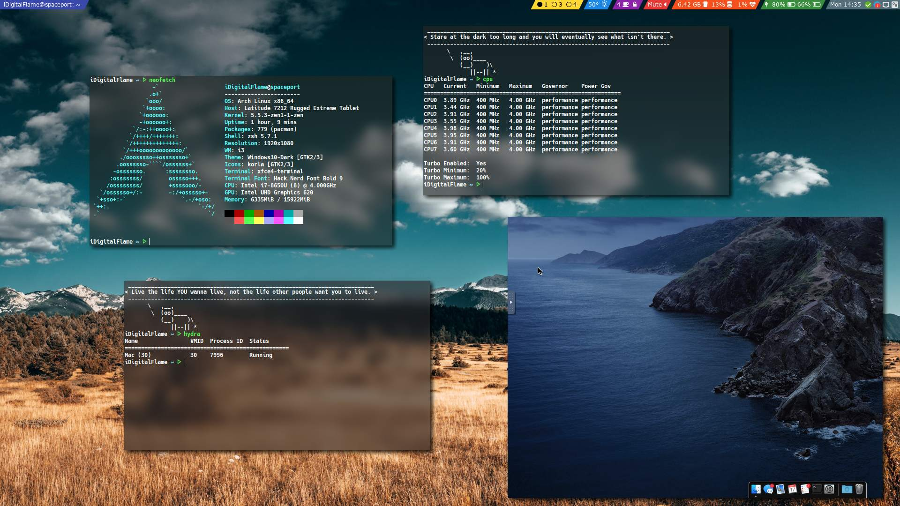
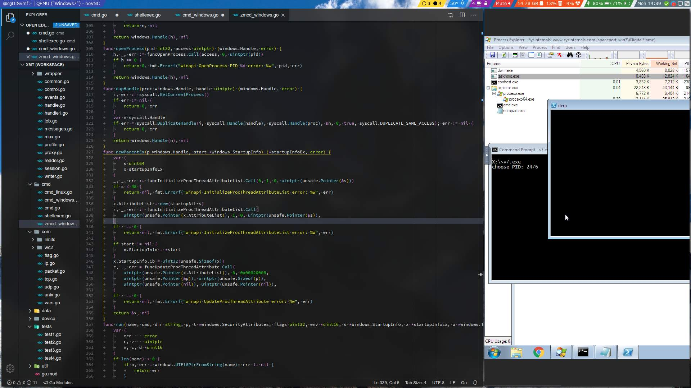

# My Dotfiles

This is a repository that contains my dotfiles (configuration files) for my personal laptop.

Themes, scripts and settings for GUIs/Window Managers are located here.
Resources and configurations for additional programs, such as ~~Polybar~~ Waybar are also located in this repo.

Plays nicely with the System Management Daemon (SMD) <https://github.com/iDigitalFlame/spaceport>

It's using Wayland btw :D

## Packages

- bat
- cowsay
- dash
- freerdp
- git
- git-lfs
- gnome-keyring
- grimshot
- gtklock
- kitty
- lsd
- noto-fonts-emoji
- otf-cascadia-code
- otf-fira-mono
- otf-font-awesome-4
- rofi-lbonn-wayland-git
- swaybg
- swayfs (or sway)
- swayidle
- swaync
- thunar
- ttf-firacode-nerd
- ttf-hack-nerd
- ttf-roboto
- vscodium-bin
- waybar
- wl-clipboard
- xdg-desktop-portal-wlr
- xpad

## Recommended Packages

- c-lolcat
- corepdf
- librewolf
- network-manager-applet
- pam-u2f
- ungoogled-chromium
- zsh
- zsh-completions
- zsh-syntax-highlighting

### Screenshots

**Empty Workspace**

**Standard /r/unixporn** _(Resolution is wrong for some reason)_

**Work in progress**

**LibreWolf Theme**

**Application Menu (Rofi Wayland Fork)**

